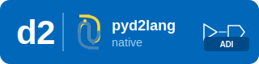

  

d2 lang direct bindings in python

## License

This project is licensed under the MPL-2.0 License. See the [LICENSE](https://github.com/tfcollins/pyd2lang-native/blob/main/LICENSE) file for details. See dependent code for licensing formation.

## Dependencies

This project builds the d2lang library as a shared object (.so) for Linux, a dynamic link library (.dll) for Windows, and a dynamic library (.dylib) for macOS. Then packages them into a Python wheel for distribution. For information and licensing details, please refer to the LICENSE files included in the project.
- d2lang: [Project repo](https://github.com/analogdevicesinc/d2lang) and [License](https://github.com/tfcollins/pyd2lang-native/blob/main/D2_LICENSE.txt)