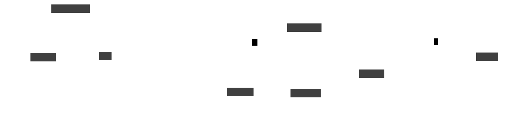
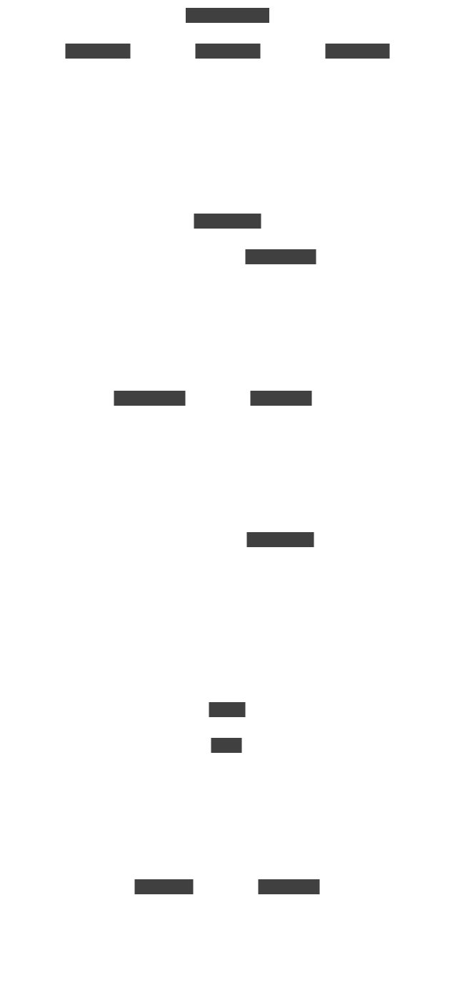
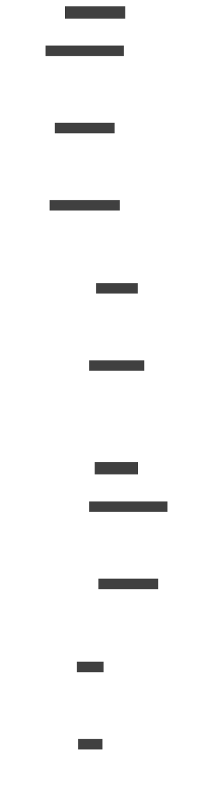
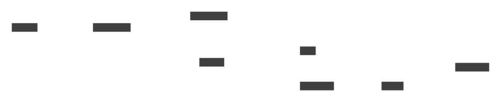

Examples
========

Basic Diagram
-------------

Compile a simple D2 diagram to SVG:

.. code-block:: python

   import d2

   svg = d2.compile("x -> y -> z")

   # Write to file
   with open("output.svg", "w") as f:
       f.write(svg)

Signal Chain
------------

A typical ADI signal chain with sensor, conditioning, and digitization:

.. code-block:: python

   import d2

   code = """
   direction: right

   sensor: ADXL345 { class: sensor }
   amp: LT6230 { class: amplifier }
   filt: LTC1560 { class: filter-lp }
   adc: AD7606 { class: adc }
   dsp: ADSP-21489 { class: dsp-fpga }

   sensor -> amp: Analog { class: adi-signal-analog }
   amp -> filt: Amplified { class: adi-signal-analog }
   filt -> adc: Filtered { class: adi-signal-analog }
   adc -> dsp: SPI { class: adi-signal-digital }

   clk: AD9520 { class: clock }
   clk -> adc: MCLK { class: adi-signal-clock }
   """

   svg = d2.compile(code, library="adi")

   with open("signal-chain.svg", "w") as f:
       f.write(svg)

.. image:: _static/example-signal-chain.svg
   :alt: Signal chain example
   :align: center
   :class: only-light

Nested Subsystems
-----------------

Group components into named subsystem containers:

.. code-block:: python

   import d2

   code = """
   analog-frontend: Analog Front End {
     class: adi-container

     amp: LNA { class: amplifier }
     filt: Anti-Alias { class: filter-lp }
     adc: AD7606 { class: adc }

     amp -> filt { class: adi-signal-analog }
     filt -> adc { class: adi-signal-analog }
   }

   digital-backend: Digital Backend {
     class: adi-container

     dsp: ADSP-21489 { class: dsp-fpga }
     dac: AD5686 { class: dac }

     dsp -> dac { class: adi-signal-digital }
   }

   analog-frontend -> digital-backend: SPI { class: adi-signal-digital }
   """

   svg = d2.compile(code, library="adi")

   with open("nested.svg", "w") as f:
       f.write(svg)

RF Receiver
-----------

An RF receiver front end with LO generation:

.. code-block:: python

   import d2

   code = """
   direction: right

   rf-frontend: RF Front End {
     class: adi-container

     lna: HMC8410 { class: amplifier }
     bpf: SAW Filter { class: filter-bp }
     mix: ADL5801 { class: mixer }

     lna -> bpf { class: adi-signal-analog }
     bpf -> mix { class: adi-signal-analog }
   }

   lo: LO Generation {
     class: adi-container

     pll: ADF4351 { class: pll }
     vco: VCO { class: oscillator }
     pll -> vco { class: adi-signal-analog }
   }

   lo -> rf-frontend.mix: LO { class: adi-signal-analog }

   adc: AD9680 { class: adc }
   rf-frontend -> adc: IF { class: adi-signal-analog }
   """

   svg = d2.compile(code, library="adi")

   with open("rf-receiver.svg", "w") as f:
       f.write(svg)

Dark Theme
----------

Use the dark variant for dark-background contexts:

.. code-block:: python

   import d2

   code = """
   adc: AD7606 { class: adc }
   dac: AD5686 { class: dac }
   adc -> dac: SPI { class: adi-signal-digital }
   """

   svg = d2.compile(code, library="adi", theme="dark")

   with open("dark-adi.svg", "w") as f:
       f.write(svg)

Error Handling
--------------

Invalid D2 code raises ``RuntimeError``:

.. code-block:: python

   import d2

   try:
       svg = d2.compile("invalid {{ code", library="adi")
   except RuntimeError as e:
       print(f"Compilation failed: {e}")

Programmatic Component Listing
------------------------------

Iterate over available components:

.. code-block:: python

   import d2

   print("ADI components:")
   for comp in d2.ADI_COMPONENTS:
       print(f"  - {comp}")

   print("SW components:")
   for comp in d2.SW_COMPONENTS:
       print(f"  - {comp}")

SW: Agent Pipeline
------------------

An AI agent pipeline with seed instructions, auditing, and scoring:

.. code-block:: python

   import d2

   code = """
   seeds: Seed Instructions { class: sw-container-white
     a: Instruction A { class: sw-document }
     b: Instruction B { class: sw-document }
     c: Instruction C { class: sw-document }
   }

   loop: Auditing Loop { class: sw-container
     agent: Auditor Agent { class: sw-agent }
     send: Send message { class: sw-action }
     tools: Create tools { class: sw-tool }
     target: Target Model { class: sw-model }

     agent -> send -> target { class: sw-flow }
     agent -> tools -> target { class: sw-flow }
     target -> agent { class: sw-flow-feedback }
   }

   scoring: Scoring { class: sw-container-cream
     judge: Judge { class: sw-eval }
     s1: Concerning { class: sw-score }
     s2: Sycophancy { class: sw-score }
     judge -> s1 { class: sw-flow-light }
     judge -> s2 { class: sw-flow-light }
   }

   seeds -> loop { class: sw-flow-data }
   loop -> scoring { class: sw-flow-data }
   """

   svg = d2.compile(code, library="sw")

   with open("agent-pipeline.svg", "w") as f:
       f.write(svg)

SW: Workflow Comparison
-----------------------

Side-by-side workflow comparison with color-coded steps:

.. code-block:: python

   import d2

   code = """
   manual: Manual Process { class: sw-container-cream
     s1: Formulate hypothesis { class: sw-step-white }
     s2: Design scenarios { class: sw-step-blue }
     s3: Build environments { class: sw-step-amber }
     s4: Run models { class: sw-step-green }
     s5: Analyze results { class: sw-step-white }
     s1 -> s2 -> s3 -> s4 -> s5 { class: sw-flow-light }
   }

   automated: Automated { class: sw-container-cream
     s1: Formulate hypothesis { class: sw-step-white }
     s2: Design scenarios { class: sw-step-blue }
     system: System { class: sw-step-amber }
     s4: Iterate { class: sw-step-green }
     s1 -> s2 -> system -> s4 { class: sw-flow-light }
   }

   manual.s3 -> automated.system { class: sw-flow }
   """

   svg = d2.compile(code, library="sw")

   with open("workflow.svg", "w") as f:
       f.write(svg)

SW: Microservice Architecture
-----------------------------

A typical backend architecture:

.. code-block:: python

   import d2

   code = """
   direction: right

   client: Web App { class: sw-browser }
   gw: API Gateway { class: sw-gateway }
   auth: Auth Service { class: sw-server }
   api: Main API { class: sw-api }
   db: PostgreSQL { class: sw-database }
   cache: Redis { class: sw-cache }
   queue: Task Queue { class: sw-queue }
   worker: Worker { class: sw-function }

   client -> gw { class: sw-flow }
   gw -> auth { class: sw-flow-control }
   gw -> api { class: sw-flow-data }
   api -> db { class: sw-flow-data }
   api -> cache { class: sw-flow }
   api -> queue { class: sw-flow-async }
   queue -> worker { class: sw-flow-async }
   worker -> db { class: sw-flow-data }
   """

   svg = d2.compile(code, library="sw")

   with open("microservice.svg", "w") as f:
       f.write(svg)

SW: Dark Theme
--------------

Use the dark variant for dark-background contexts:

.. code-block:: python

   import d2

   code = """
   agent: Agent { class: sw-agent }
   model: LLM { class: sw-model }
   agent -> model { class: sw-flow }
   model -> agent { class: sw-flow-feedback }
   """

   svg = d2.compile(code, library="sw", theme="dark")

   with open("dark.svg", "w") as f:
       f.write(svg)

