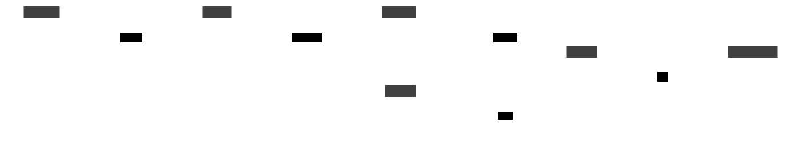

ADI Theme
=========

The ADI theme provides Analog Devices brand colors and styling classes based on
the `analog.com <https://www.analog.com>`_ brand guidelines.

Color Palette
-------------

Light Theme
~~~~~~~~~~~

The default light theme uses these brand colors:

.. raw:: html

   <table style="border-collapse:collapse; margin:1em 0;">
   <tr>
     <td style="background:#0067B9; width:60px; height:40px; border:1px solid #ccc;"></td>
     <td style="padding-left:12px;"><strong>ADI Blue</strong> — <code>#0067B9</code> — Primary brand color</td>
   </tr>
   <tr>
     <td style="background:#004A87; width:60px; height:40px; border:1px solid #ccc;"></td>
     <td style="padding-left:12px;"><strong>Dark Blue</strong> — <code>#004A87</code> — Headers, emphasis</td>
   </tr>
   <tr>
     <td style="background:#4D9AD5; width:60px; height:40px; border:1px solid #ccc;"></td>
     <td style="padding-left:12px;"><strong>Light Blue</strong> — <code>#4D9AD5</code> — Secondary accent</td>
   </tr>
   <tr>
     <td style="background:#A8D4F0; width:60px; height:40px; border:1px solid #ccc;"></td>
     <td style="padding-left:12px;"><strong>Pale Blue</strong> — <code>#A8D4F0</code> — Highlights</td>
   </tr>
   <tr>
     <td style="background:#E8F4FD; width:60px; height:40px; border:1px solid #ccc;"></td>
     <td style="padding-left:12px;"><strong>Background Blue</strong> — <code>#E8F4FD</code> — Container fill</td>
   </tr>
   <tr>
     <td style="background:#231F20; width:60px; height:40px; border:1px solid #ccc;"></td>
     <td style="padding-left:12px; color:inherit;"><strong>Soft Black</strong> — <code>#231F20</code> — Text, strokes</td>
   </tr>
   <tr>
     <td style="background:#58595B; width:60px; height:40px; border:1px solid #ccc;"></td>
     <td style="padding-left:12px;"><strong>Grey</strong> — <code>#58595B</code> — Secondary text</td>
   </tr>
   <tr>
     <td style="background:#D1D3D4; width:60px; height:40px; border:1px solid #ccc;"></td>
     <td style="padding-left:12px;"><strong>Light Grey</strong> — <code>#D1D3D4</code> — Borders, dividers</td>
   </tr>
   <tr>
     <td style="background:#C8102E; width:60px; height:40px; border:1px solid #ccc;"></td>
     <td style="padding-left:12px;"><strong>Red</strong> — <code>#C8102E</code> — Power rails</td>
   </tr>
   <tr>
     <td style="background:#007A33; width:60px; height:40px; border:1px solid #ccc;"></td>
     <td style="padding-left:12px;"><strong>Green</strong> — <code>#007A33</code> — Clock signals</td>
   </tr>
   </table>

Dark Theme
~~~~~~~~~~

The dark theme inverts colors for dark backgrounds:

.. raw:: html

   <table style="border-collapse:collapse; margin:1em 0;">
   <tr>
     <td style="background:#4D9AD5; width:60px; height:40px; border:1px solid #555;"></td>
     <td style="padding-left:12px;"><strong>ADI Blue</strong> — <code>#4D9AD5</code> — Primary accent</td>
   </tr>
   <tr>
     <td style="background:#0067B9; width:60px; height:40px; border:1px solid #555;"></td>
     <td style="padding-left:12px;"><strong>Dark Blue</strong> — <code>#0067B9</code> — Deep accent</td>
   </tr>
   <tr>
     <td style="background:#0D1B2A; width:60px; height:40px; border:1px solid #555;"></td>
     <td style="padding-left:12px;"><strong>Background</strong> — <code>#0D1B2A</code> — Container fill</td>
   </tr>
   <tr>
     <td style="background:#E0E0E0; width:60px; height:40px; border:1px solid #555;"></td>
     <td style="padding-left:12px;"><strong>Text</strong> — <code>#E0E0E0</code> — Primary text</td>
   </tr>
   <tr>
     <td style="background:#FF6B6B; width:60px; height:40px; border:1px solid #555;"></td>
     <td style="padding-left:12px;"><strong>Red</strong> — <code>#FF6B6B</code> — Power rails</td>
   </tr>
   <tr>
     <td style="background:#66BB6A; width:60px; height:40px; border:1px solid #555;"></td>
     <td style="padding-left:12px;"><strong>Green</strong> — <code>#66BB6A</code> — Clock signals</td>
   </tr>
   </table>

Signal Classes
--------------

Apply these classes on connections (edges) between components to indicate
signal type. Each uses a distinct color and stroke style.

.. list-table::
   :header-rows: 1
   :widths: 22 18 15 45

   * - Class
     - Color
     - Stroke
     - Use For
   * - ``adi-signal``
     - ADI Blue ``#0067B9``
     - Solid, 2px
     - Default signal connections
   * - ``adi-signal-analog``
     - Soft Black ``#231F20``
     - Solid, 2px
     - Analog signal paths
   * - ``adi-signal-digital``
     - ADI Blue ``#0067B9``
     - Dashed, 2px
     - Digital buses (SPI, I2S, JESD204B)
   * - ``adi-signal-clock``
     - Green ``#007A33``
     - Dashed, 1px
     - Clock distribution
   * - ``adi-signal-power``
     - Red ``#C8102E``
     - Solid, 2px
     - Power supply rails

Example with all signal types:

.. code-block:: text

   amp: LT6230 { class: amplifier }
   adc: AD7606 { class: adc }
   clk: AD9520 { class: clock }
   pwr: ADP7118 { class: voltage-regulator }

   amp -> adc: Analog { class: adi-signal-analog }
   adc -> dsp: SPI { class: adi-signal-digital }
   clk -> adc: MCLK { class: adi-signal-clock }
   pwr -> adc: 3.3V { class: adi-signal-power }

Layout Classes
--------------

adi-container
~~~~~~~~~~~~~

Groups related components into a labeled subsystem block with ADI blue border
and light blue fill.

.. code-block:: text

   frontend: Analog Front End {
     class: adi-container

     amp: LNA { class: amplifier }
     adc: AD7606 { class: adc }
     amp -> adc { class: adi-signal-analog }
   }

.. list-table::
   :widths: 30 35 35

   * - Property
     - Light
     - Dark
   * - Fill
     - ``#E8F4FD``
     - ``#0D1B2A``
   * - Stroke
     - ``#0067B9``, 2px
     - ``#4D9AD5``, 2px
   * - Border radius
     - 8px
     - 8px
   * - Drop shadow
     - Yes
     - Yes
   * - Font color
     - ``#231F20``
     - ``#E0E0E0``

adi-title
~~~~~~~~~

Diagram title styled with ADI brand colors. Renders as a text-only shape.

.. code-block:: text

   title: RF Receiver System { class: adi-title }

.. list-table::
   :widths: 30 35 35

   * - Property
     - Light
     - Dark
   * - Font size
     - 24
     - 24
   * - Font color
     - ``#0067B9``
     - ``#4D9AD5``
   * - Bold
     - Yes
     - Yes

adi-note
~~~~~~~~

Annotation block for design notes. Renders as a page shape with muted colors.

.. code-block:: text

   note: |md
     ADC sampling rate: 200 kSPS
     Resolution: 16-bit
   | { class: adi-note }

.. list-table::
   :widths: 30 35 35

   * - Property
     - Light
     - Dark
   * - Fill
     - ``#FFFDE7``
     - ``#2A2A1E``
   * - Stroke
     - ``#D1D3D4``
     - ``#3A3A3A``
   * - Font color
     - ``#58595B``
     - ``#B0B0B0``
   * - Style
     - Italic
     - Italic

Theme Comparison
----------------

Light:

Dark:

Using Themes
------------

.. code-block:: python

   import d2

   # Light theme (default)
   svg_light = d2.compile(code, library="adi")

   # Dark theme
   svg_dark = d2.compile(code, library="adi", theme="dark")
